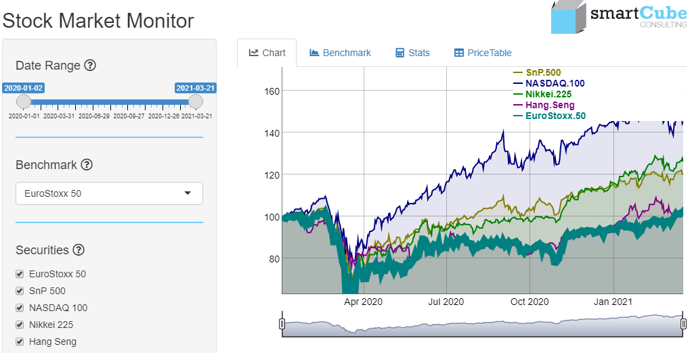

# **Stock Market Monitor** :chart:

Stock Market Monitor allows you to view performance charts, compare against a benchmark, calculate the stats and view and save the stock price table of important market indices. The pricing values will be recalculated to start with value 100 for better comparison. Note the slider beyond the Chart and Benchmark panels for further changing the window size.
The main functions are:
* Select a benchmark for comparison to individual security performance
* Select one or more securities for comparison to benchmark performance
* View the performance chart and comparison chart against the selected benchmark
* Calculate and compare key ratios
